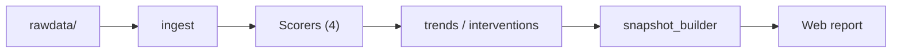
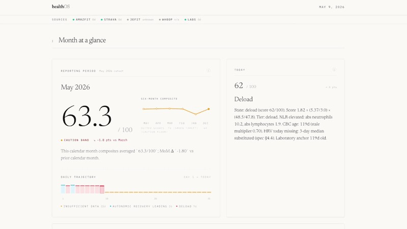
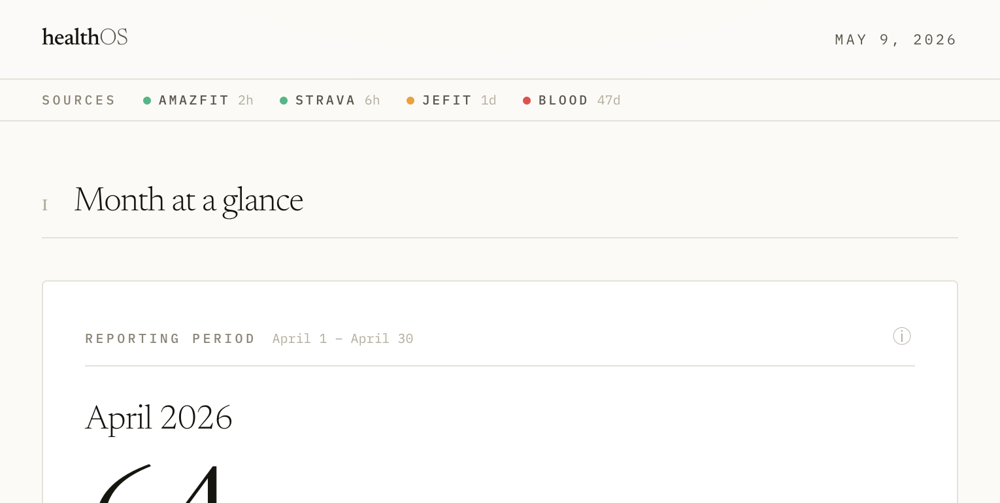

# healthOS

**Personal health intelligence layer.** Ingests messy multi-source health data (Zepp/Amazfit, JeFit, Strava, blood panels) and produces monthly reports with a composite readiness score, bio-age proxy, and ranked top-3 interventions.

## Quickstart (5 minutes)

```bash
git clone <repo>
cd healthOS
pip install -r requirements.txt
cd web && npm install && cd ..
make dev
```

Open `http://localhost:5173`. Click **Analyze my health data** and follow the three steps (gather → LLM CSV → upload). The web UI talks to a small local API on port **8787** that saves `rawdata/universal.csv`, runs the pipeline, and refreshes `web/src/data/snapshot.json`. Press **Ctrl+C** to stop Vite and the API when running `make dev` with parallel jobs.

To regenerate the committed **demo dashboard** from `data/examples/alex_demo/` (fixture slice) instead: run `make demo-pipeline` then `cd web && npm run dev`, or use `make demo` for pipeline + install + build + dev.

⚠️ **About the demo data:** The synthetic dataset deliberately has limited HRV coverage to demonstrate the system's `insufficient_data` behavior — the headline state will read as such. Run on your own data (see below) to see the full composite.

## What this is

**Personal health intelligence layer.** Ingests messy multi-source health data (Zepp/Amazfit, JeFit, Strava, blood panels) and produces monthly reports with a composite readiness score, bio-age proxy, and ranked top-3 interventions.

### The wedge

No consumer device sees all your data. healthOS does—and derives more insights because of it.

By fusing data sources that no consumer app combines, healthOS turns fragmented wearables, workouts, and blood labs into a unified physiological picture:

- **CBC differential** (NLR, monocytes) — no wearable ingests this
- **Wearable HRV** — every wearable has it; none ties it to inflammatory markers
- **Workout pace/HR decoupling** — TrainingPeaks computes this but it's coach-facing
- **Sleep regularity** — Phillips SRI is peer-reviewed; no consumer app implements it

## Pipeline

End-to-end flow from exports to the local web report. The **four scorers** are NLR×HRV readiness, SRI, aerobic decoupling, and the composite readiness layer; **bio-age** runs on the daily systemic CSV after that (see `Makefile` for the exact order). Environment variables such as `RAWDATA_ROOT` and `HEALTHOS_PROFILE` point the same commands at your tree or at the committed demo slice.



## Demo (web report)

Rendered after `make demo` (ingest through `snapshot_builder`, then `npm run dev` in `web/`). The page reads `web/src/data/snapshot.json`.

### Preview

Sources strip (Amazfit, Strava, labs), **Month at a glance** with composite trend and daily trajectory, and **Today** with scored rationale — editorial layout in Newsreader / mono data labels:



### Synthetic fixture snapshot

The committed demo slice (`data/examples/alex_demo/`) often drives `insufficient_data` on the headline to illustrate guardrails; an alternate capture:



## Data Sources & Quirks

| Source | What | Quirk | Weighting |
|--------|------|-------|-----------|
| Zepp/Amazfit | HRV, RHR, sleep state | HRV logged at wake, not during sleep. Less reliable than chest strap. | Lower |
| JeFit | Lift volume, 1RM estimates | Strain proxy | Standard |
| Strava | Cardio sessions, pace, HR | HR zones often miscalibrated — trust pace/power over HR. | Standard |
| Blood panels | CBC differential, markers | Episodic, not time-series. Context, not signal. | Context-only |

## Scoring Philosophy

- **Transparent weighted formulas over ML.** Every number is defendable.
- **Composite readiness** = `f(NLR, HRV trend, RHR trend, sleep regularity, strain balance, subjective)`
- **Bio-age proxy is illustrative**, not medical guidance. We're honest about uncertainty.
- **Single headline number** with drill-downs underneath for interpretation.

## Tech stack

- **Python 3.9+** — ingest, scoring, trends, interventions, snapshot JSON (`src/`, `Makefile`).
- **pandas / NumPy / SciPy** — tabular merges, rolling stats, scoring math.
- **YAML + CSV (+ Markdown blood panels)** — inputs under `rawdata/` (see `src/ingest/schema.md`).
- **Parquet and intermediate artifacts** — scorer outputs on disk; paths configurable via `HEALTHOS_*` env vars where implemented.
- **Web UI** — **Vite 5**, **React 19**, **TypeScript**, **Tailwind CSS**, **Recharts**, **Framer Motion** (`web/`).

## Run the demo

One command from the repo root runs the full demo pipeline on committed **`data/examples/alex_demo`** (mirrors a `rawdata/` layout) and starts the Vite dev server:

```bash
make demo
```

That refreshes `web/src/data/snapshot.json` and `web/src/data/llm_prompt.txt` before `npm run dev`. Override dates by passing Make variables, e.g. `SINCE`, `UNTIL`, `MONTH` (see `Makefile`). To rebuild the demo CSV slice from your machine’s private `rawdata/`, use `make demo-dataset` (see `scripts/build_alex_demo_dataset.py`).

## Run on your own data

Easiest path: copy `data/examples/alex_demo/` as a template and replace the contents with your own exports.

Scaffold an empty private tree at **`rawdata/`** (gitignored): `bash scripts/init_private_rawdata.sh`. Full layout and env examples: **`docs/private-rawdata-layout.md`**.

1. **Directory layout** — Point **`RAWDATA_ROOT`** at a folder with the same *shape* as the demo: Amazfit Helio exports under an `amazfit helio/` tree (`SLEEP`, `SLEEP_MINUTE`, `HEARTRATE_AUTO`, `ACTIVITY`, `ACTIVITY_MINUTE`, …), **`strava/activities.csv`**, JeFit export **`bigAppleALEX_*.csv`** at the root of `RAWDATA_ROOT`, **`blood_panels/*.md`**, plus optional **`profile.yaml`**, **`context_flags.yaml`**, and a generated or maintained **`systemic_daily.csv`** for month-level trends (see `python -m src.ingest.load_all --help` and per-loader expectations in `src/ingest/`).

2. **Run the same modules as in `Makefile` `demo`** — Set `RAWDATA_ROOT`, `CONTEXT_FLAGS`, `HEALTHOS_PROFILE` and execute, in order: `src.ingest.load_all`, `src.score.nlr_hrv_readiness`, `src.score.sri`, `src.score.aerobic_decoupling`, `src.score.composite`, `src.score.bio_age`, `src.trends`, `src.interventions`, `src.report.snapshot_builder` (writing `web/src/data/snapshot.json`), then `cd web && npm run dev`.

3. **Defaults** — With no override, loaders read **`rawdata/`** at the repo root (`src/ingest/config.py`).

## Get LLM recommendations

The dashboard surfaces your data and the divergence patterns it found. For ranked, personalized recommendations, the dashboard generates a prompt with your snapshot data and the physiological framework baked in.

Click "Copy prompt for your LLM" → paste into Claude, ChatGPT, Gemini, or whatever you already use → get top 3 ranked interventions. Your data never goes through a third-party server unless you choose to paste it.

No API keys, no accounts, no vendor lock.

## Three flagship metrics

Each metric has a full computable spec under `src/score/specs/`. The paragraphs below are the *why*; citations ground the interpretive claims.

**NLR × HRV training-readiness.** Neutrophil-to-lymphocyte ratio (NLR) condenses innate vs adaptive immune balance into one number, while HRV reflects parasympathetic tone; together they stress-test the idea that autonomic recovery and inflammatory state can diverge or align across days (mechanism and exercise context: e.g. Lee, Sennels & Berg, *Eur J Appl Physiol* 2021; Walsh / Gleeson line on N/L as exercise-stress signal). Population NLR distributions and “normal” ranges are reported in working-age adults (Forget *et al.*, 2017), which helps calibrate how extreme a draw is before it meets wearable HRV on the same calendar.

**Sleep Regularity Index (SRI).** SRI measures day-to-day *consistency* of sleep and wake at matched clock times—not duration or subjective quality—so it picks up circadian mistiming that total sleep time can miss. The canonical 0–100 construction and the undergraduate cohort validation come from Phillips *et al.*, *Scientific Reports* 2017. In large prospective work, lower SRI tracks higher mortality hazard; for example Windred *et al.*, *Sleep* 2024 (UK Biobank, *n* = 60,977) report that SRI < 70 is associated with substantially higher all-cause mortality than higher SRI, with SRI often outperforming sleep duration as a predictor.

**Aerobic decoupling (pace:HR, trend).** At steady aerobic power, heart rate drifts upward as stroke volume and plasma volume fall with dehydration and thermoregulatory strain, so the pace-to-HR relationship is an integrative read of economy and stress on that day. González-Alonso & Coyle (*J Appl Physiol* 1992, PMID 1447078) showed graded dehydration linearly increasing HR and reducing stroke volume; later running-economy reviews (e.g. Saunders *et al.*, *Sports Med* 2004; Foster *et al.*) frame pace/HR and efficiency as sensitive to training, environment, and fatigue. healthOS uses a Z-score trend over comparable sessions, with cross-reads to HRV where the spec says to (see `aerobic-decoupling-spec.md`).

## Repository layout

```
src/
├── ingest/           Per-source CSV loaders, normalized to common schema
├── score/            Composite scoring, bio-age proxy
│   └── specs/        Detailed formulas for readiness, SRI, aerobic decoupling
├── trends/           Month-over-month analysis, statistical significance
├── interventions/    Ranker, evidence-tagged recommendations
└── report/           Monthly report generator

skills/              Domain knowledge: health reasoning, formulas, assumptions
data/                Local data storage (CSV exports, caches)
.claude/             Custom instructions and context

CLAUDE.md            Development guidelines, guardrails
```

## Implementation Specs

Three detailed specification documents define the scoring engine:

### 1. **NLR × HRV Training-Readiness Score** (`nlr-hrv-readiness-spec.md`)
- Formula: `readiness_score = (NLR / 3.0) × (baseline_HRV / current_HRV)`
- Thresholds: `>= 1.5` (deload), `1.0–1.5` (caution), `< 1.0` (green)
- Handles stale CBC data, HRV anomalies, post-illness lag detection
- Output includes confidence scores and flags

### 2. **Sleep Regularity Index (SRI)** (`sri-spec.md`)
- Canonical Phillips formula: measures day-to-day sleep/wake consistency
- Rolling 14-day window, 1-minute epoch resolution
- Thresholds: `< 70` (irregular), `70–80` (moderate), `>= 80` (high)
- Handles timezone shifts, missing epochs, shift-work patterns
- Backup proxy: sleep onset standard deviation

### 3. **Aerobic Decoupling Trend** (`aerobic-decoupling-spec.md`)
- Per-session: `decoupling_pct = ((EF_first_half - EF_second_half) / EF_first_half) × 100`
- Trend layer: Z-score of efficiency factor over 30-day rolling window
- Cross-signals with HRV to distinguish central vs peripheral fatigue
- Handles heat/dehydration, illness, and route non-comparability confounders
- Requires >= 30-minute steady aerobic sessions

## Guardrails

- 🚫 **No synthetic data.** Ever.
- 📊 **Statistical methods first.** ML only if explicitly requested.
- 📐 **Formula before code.** Full spec for any component >30 lines before implementation.
- 🚩 **Flag uncertainty.** When unsure about physiological claims, flag explicitly.
- 📋 **Spec before code.** All major scoring components have detailed specs.

## Getting Started

### Requirements
- Python 3.9+
- Pandas, NumPy, SciPy
- Per-source export files (see `src/ingest/` for expected formats)

### Basic Usage

Ingest everything under `RAWDATA_ROOT` into a unified observation frame (see `src/ingest/load_all.py` and `src/ingest/schema.md`):

```python
from pathlib import Path

from src.ingest.load_all import load_all

df, episodic = load_all(rawdata_root=Path("rawdata"), since="2026-03-01")
# df = time-series rows; episodic = blood panels, body weight, etc.
```

Scoring is run via **`python -m src.score.<module>`** modules (NLR×HRV, SRI, aerobic decoupling, composite, bio_age) and the **`Makefile` `demo`** target — not a single `composite_readiness(...)` helper.

### Monthly snapshot (web JSON)

After running the pipeline through composite and related steps, build the UI snapshot (this also writes `web/src/data/llm_prompt.txt` when `profile.yaml` and `skills/health-reasoning.md` resolve):

```bash
python -m src.report.snapshot_builder --date 2026-04-30 --out web/src/data/snapshot.json
```

Then `cd web && npm run dev` (or `npm run build`) to view or ship the report.

## Domain Knowledge

See **`skills/health-reasoning.md`** for the physiological foundations:

- **Section 1:** Inflammatory + autonomic fusion (NLR ↔ HRV mechanism)
  - Neutrophils ↔ sympathetic, lymphocytes ↔ parasympathetic
  - Diagnostic patterns for recovery stages
  - Literature: Forget 2017, Lee/Sennels/Berg 2021, Walsh/Gleeson

- **Section 2:** Sleep regularity (Phillips formula, mortality data)
  - Why SRI > sleep duration as a predictor
  - References: Phillips 2017, Windred 2024, Zhang 2023

- **Section 3:** Aerobic decoupling
  - González-Alonso & Coyle mechanism
  - Central vs peripheral fatigue distinction
  - Friel methodology, EF + HRV cross-interpretation

- **Section 4:** Integration
  - Convergent signals (all three degrading) = strong reload-risk signal
  - Divergent signals = diagnostic insights

## Validation & Testing

- `evals/` — Labeled days, divergence analysis between computed and felt scores
- Statistical significance testing for month-over-month changes
- Confounded signal detection (heat, illness, route changes)

## Data Privacy

- **Local computation.** No cloud sync or external processing.
- **Your data, your rules.** Keep everything in your own environment.
- CSV exports stored in `data/` directory

## Limitations & Caveats

- **Blood panels are episodic**, not continuous. They provide context, not real-time signals.
- **Zepp HRV is less reliable** than chest strap. Weighted accordingly in composite.
- **Bio-age is illustrative**, not medical guidance. Consult healthcare providers.
- **Strava HR zones are often miscalibrated.** We prefer pace/power metrics.
- **Sleep regularity ≠ sleep quality.** SRI captures timing consistency, not depth or restoration.
- **Aerobic decoupling is influenced by environment.** Heat, hydration, and illness are confounders.

## Development

See **`CLAUDE.md`** for development guidelines:
- Guardrails on synthetic data, ML use, formula-first approach
- Spec-before-code policy for major components
- Physiological-claim flagging requirements

## Contributing

This is a personal health project. Thoughtful improvements welcome:

- Statistical improvements to scoring algorithms
- New data source integrations (with proper normalization)
- Validation studies against clinical markers
- Better documentation of assumptions

See [CLAUDE.md](./CLAUDE.md) for development guidelines.

## License

MIT License — See LICENSE file for details.

## Author

Built with ❤️ by **[Alex Shibu](https://alexshibu.com)**.

## Not a medical device

**healthOS is a personal exploration and analysis tool for your own exports.** It is **not** a medical device, not a diagnostic, and not a substitute for professional care. Composite scores, the bio-age proxy, NLR×HRV, SRI, and aerobic trends are **illustrative** combinations of your data and transparent formulas—use them to think and plan, not to self-treat or override clinical judgment. Always consult qualified healthcare professionals for medical decisions.
