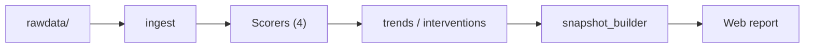

# healthOS

**Personal health intelligence layer.** Ingests messy multi-source health data (Zepp/Amazfit, JeFit, Strava, blood panels) and produces monthly reports with a composite readiness score, bio-age proxy, and ranked 80/20 interventions.

## The Wedge

No consumer device sees all your data. healthOS does—and derives more insights because of it.

By fusing data sources that no consumer app combines, healthOS turns fragmented wearables, workouts, and blood labs into a unified physiological picture:

- **CBC differential** (NLR, monocytes) — no wearable ingests this
- **Wearable HRV** — every wearable has it; none ties it to inflammatory markers
- **Workout pace/HR decoupling** — TrainingPeaks computes this but it's coach-facing
- **Sleep regularity** — Phillips SRI is peer-reviewed; no consumer app implements it

## Pipeline

End-to-end flow from exports to the local web report. The **four scorers** are NLR×HRV readiness, SRI, aerobic decoupling, and the composite readiness layer; **bio-age** runs on the daily systemic CSV after that (see `Makefile` for the exact order). Environment variables such as `RAWDATA_ROOT` and `HEALTHOS_PROFILE` point the same commands at your tree or at the committed demo slice.



## Demo (web report)

Rendered after `make demo` (ingest through `snapshot_builder`, then `npm run dev` in `web/`). The page reads `web/src/data/snapshot.json`.


## Three flagship metrics

Each metric has a full computable spec under `src/score/specs/`. The paragraphs below are the *why*; citations ground the interpretive claims.

**NLR × HRV training-readiness.** Neutrophil-to-lymphocyte ratio (NLR) condenses innate vs adaptive immune balance into one number, while HRV reflects parasympathetic tone; together they stress-test the idea that autonomic recovery and inflammatory state can diverge or align across days (mechanism and exercise context: e.g. Lee, Sennels & Berg, *Eur J Appl Physiol* 2021; Walsh / Gleeson line on N/L as exercise-stress signal). Population NLR distributions and “normal” ranges are reported in working-age adults (Forget *et al.*, 2017), which helps calibrate how extreme a draw is before it meets wearable HRV on the same calendar.

**Sleep Regularity Index (SRI).** SRI measures day-to-day *consistency* of sleep and wake at matched clock times—not duration or subjective quality—so it picks up circadian mistiming that total sleep time can miss. The canonical 0–100 construction and the undergraduate cohort validation come from Phillips *et al.*, *Scientific Reports* 2017. In large prospective work, lower SRI tracks higher mortality hazard; for example Windred *et al.*, *Sleep* 2024 (UK Biobank, *n* = 60,977) report that SRI < 70 is associated with substantially higher all-cause mortality than higher SRI, with SRI often outperforming sleep duration as a predictor.

**Aerobic decoupling (pace:HR, trend).** At steady aerobic power, heart rate drifts upward as stroke volume and plasma volume fall with dehydration and thermoregulatory strain, so the pace-to-HR relationship is an integrative read of economy and stress on that day. González-Alonso & Coyle (*J Appl Physiol* 1992, PMID 1447078) showed graded dehydration linearly increasing HR and reducing stroke volume; later running-economy reviews (e.g. Saunders *et al.*, *Sports Med* 2004; Foster *et al.*) frame pace/HR and efficiency as sensitive to training, environment, and fatigue. healthOS uses a Z-score trend over comparable sessions, with cross-reads to HRV where the spec says to (see `aerobic-decoupling-spec.md`).
## Composite Scorer: State-First Design

The readiness engine (`src/score/composite.py`) uses **7 named physiological states** instead of a weighted sum:

| State | Score Band | Signal |
|-------|-----------|--------|
| `illness-risk` | 0–49 | Convergent degradation (NLR ↑, HRV ↓, RHR ↑) |
| `deload` | 50–69 | Post-strain or pre-illness threshold breach |
| `autonomic-recovery-leading` | 55–74 | HRV already recovering; NLR still elevated (wearable leads blood) |
| `peripheral-strain` | 60–74 | Accumulated workout load; HRV resilient |
| `accumulating-fatigue` | 65–79 | Early degradation; not yet critical |
| `cleared` | 75–89 | All signals green; training possible |
| `recovered` | 80–100 | Full restoration; threshold-qualified |

**Why state-first?** Weighted averages hide diagnostic disagreement. When HRV is recovering but NLR is high, that's a specific physiological story (autonomic resets before immune markers fade), not generic "medium readiness."

### Divergence as Signal

## Tech stack

- **Python 3.9+** — ingest, scoring, trends, interventions, snapshot JSON (`src/`, `Makefile`).
- **pandas / NumPy / SciPy** — tabular merges, rolling stats, scoring math.
- **YAML + CSV (+ Markdown blood panels)** — inputs under `rawdata/` (see `src/ingest/schema.md`).
- **Parquet and intermediate artifacts** — scorer outputs on disk; paths configurable via `HEALTHOS_*` env vars where implemented.
- **Web UI** — **Vite 5**, **React 19**, **TypeScript**, **Tailwind CSS**, **Recharts**, **Framer Motion** (`web/`).

## Run the demo

One command from the repo root runs the full demo pipeline on committed **`data/examples/alex_demo`** (mirrors a `rawdata/` layout) and starts the Vite dev server:

```bash
make demo
```

Override dates by passing Make variables, e.g. `SINCE`, `UNTIL`, `MONTH` (see `Makefile`). To rebuild the demo CSV slice from your machine’s private `rawdata/`, use `make demo-dataset` (see `scripts/build_alex_demo_dataset.py`).

## Run on your own data

1. **Directory layout** — Point **`RAWDATA_ROOT`** at a folder with the same *shape* as the demo: Amazfit Helio exports under an `amazfit helio/` tree (`SLEEP`, `SLEEP_MINUTE`, `HEARTRATE_AUTO`, `ACTIVITY`, `ACTIVITY_MINUTE`, …), **`strava/activities.csv`**, JeFit export **`bigAppleALEX_*.csv`** at the root of `RAWDATA_ROOT`, **`blood_panels/*.md`**, plus optional **`profile.yaml`**, **`context_flags.yaml`**, and a generated or maintained **`systemic_daily.csv`** for month-level trends (see `python -m src.ingest.load_all --help` and per-loader expectations in `src/ingest/`).

2. **Run the same modules as in `Makefile` `demo`** — Set `RAWDATA_ROOT`, `CONTEXT_FLAGS`, `HEALTHOS_PROFILE` and execute, in order: `src.ingest.load_all`, `src.score.nlr_hrv_readiness`, `src.score.sri`, `src.score.aerobic_decoupling`, `src.score.composite`, `src.score.bio_age`, `src.trends`, `src.interventions`, `src.report.snapshot_builder` (writing `web/src/data/snapshot.json`), then `cd web && npm run dev`.

3. **Defaults** — With no override, loaders read **`rawdata/`** at the repo root (`src/ingest/config.py`).

## Repository layout
When NLR, HRV, and sleep disagree, that's the insight. The scorer surfaces **11 named divergence flags** from `skills/health-reasoning.md §4`:
- `hrv-leading-recovery` — wearable sees recovery first
- `hrv-lagging-strain` — HRV slow to capture workout load
- `sleep-hinting-illness` — regularity dropped before other signals
- ...and 8 more

## Scoring Components

### 1. **NLR × HRV Readiness** (`src/score/nlr_hrv_readiness.py`)

```
score = (NLR / 3.0) × (HRV_baseline_7d / HRV_current)
```

- **Thresholds:** `>= 1.5` (deload), `1.0–1.5` (caution), `< 1.0` (green)
- **Illness adjustment:** Post-illness threshold tightens to 1.3 (via `src/context/flags.py`)
- **Stale-CBC decay:** Confidence drops linearly after 14 days; resets on new panel
- **HRV anomaly smoothing:** 3-day median filter to dampen single-night outliers
- **Output:** Parquet with confidence scores, flags, residuals

### 2. **Sleep Regularity Index (SRI)** (`src/score/sri.py`)
- Phillips formula on 14-day rolling window, 1-minute resolution
- Thresholds: `< 70` (irregular), `70–80` (moderate), `>= 80` (high)
- Handles timezone shifts, missing epochs, shift-work patterns

### 3. **Aerobic Decoupling** (`src/score/aerobic_decoupling.py`)
- Per-session: `decoupling_pct = ((EF_first_half - EF_second_half) / EF_first_half) × 100`
- 30-day rolling Z-score trend layer
- Cross-signals with HRV to distinguish central vs peripheral fatigue

### 4. **Bio-Age Proxy** (`src/score/bio_age.py`)
- Composite of NLR, HRV-to-RHR ratio, sleep consistency, VO2 proxy
- Illustrative, not medical. Uncertainty flags included.

## Data Sources & Quirks

| Source | What | Quirk | Status |
|--------|------|-------|--------|
| Zepp/Amazfit | HRV, RHR, sleep timestamps | HRV logged at wake, not during sleep. Less reliable than chest strap. | ✅ Loaded |
| JeFit | Lift volume, 1RM estimates | Strain proxy; requires session-level parse | 🚧 Blocked on fit_loader.py |
| Strava | Cardio sessions, pace, HR | HR zones miscalibrated — trust pace/power. | ✅ Loaded |
| Blood panels | CBC differential, NLR, lymphocytes, monocytes | Episodic, not time-series. Context, not signal. | ✅ Loaded (Markdown frontmatter parser) |

## Architecture

```
src/
├── ingest/              Per-source CSV/JSON loaders, normalized to common schema
│   ├── zepp.py
│   ├── jfit.py
│   ├── strava.py
│   └── blood_panels/    Markdown frontmatter parser
├── score/               Composite scoring, state rules, bio-age proxy
│   ├── composite.py     7-state rule engine with divergence flags
│   ├── nlr_hrv_readiness.py
│   ├── sri.py
│   ├── aerobic_decoupling.py
│   ├── bio_age.py
│   └── specs/           Detailed formulas (reference docs)
├── context/             Illness/travel/injury windows, user profile
│   ├── flags.py         Loads `data/context_flags.yaml`
│   └── profile.py
├── trends/              Month-over-month analysis, significance testing
├── interventions/       Ranked recommendations, evidence-tagged
└── report/              Monthly report generator

web/                     React + TypeScript dashboard
├── src/
│   ├── components/      FlagshipCards, DivergenceStrip, KPICards, etc.
│   ├── App.tsx
│   └── ...
└── ...

skills/                  Domain knowledge, reasoning frameworks
├── health-reasoning.md  Physiological foundations, literature refs
└── ...

data/
├── context_flags.yaml   Illness/travel/injury windows, lifestyle notes
└── scores/              Parquet outputs (NLR-HRV, SRI, EF, bio-age)

tests/                   45+ tests covering composite rules, edge cases, YAML integration
CLAUDE.md                Development guardrails and conventions
```

## Scoring Philosophy

- **Transparent weighted formulas over ML.** Every number is defendable.
- **State-first, not weighted-sum.** Physiological disagr eement is diagnostic.
- **Formula before code.** Full spec for any component >30 lines.
- **Divergence as signal.** Named flags capture multi-lens disagreement.
- **Honest uncertainty.** Confidence scores, stale-data decay, post-illness lag detection.

## Getting Started

### Requirements
- Python 3.9+
- Pandas, NumPy, SciPy
- Per-source export files (see `src/ingest/` for expected formats)
- React 18+ (for web dashboard)

### Basic Usage

```python
from src.ingest import load_all
from src.score import composite_readiness
from src.context import load_context

# Load all data
data = load_all(
    zepp_csv='zepp_export.csv',
    jfit_csv='jfit_export.csv',
    strava_csv='strava_export.csv',
    blood_markdown='labs.md'  # Markdown frontmatter format
)

# Load context (illness, travel, injury windows)
context = load_context('data/context_flags.yaml')

# Compute composite score
score = composite_readiness(data, context)
print(f"State: {score.state}")
print(f"Score: {score.value:.1f}/100")
print(f"Flags: {', '.join(score.divergence_flags)}")
```

### Monthly Report

```python
from src.report import generate_monthly_report

report = generate_monthly_report(
    month='2026-05',
    data=data,
    context=context
)
report.to_html('month_report.html')
```

### Web Dashboard

```bash
cd web
npm install
npm run dev
```

Dashboard displays:
- **Flagship Cards:** NLR×HRV, SRI, Aerobic Decoupling (with confidence)
- **Divergence Strip:** Flags, disagreement breakdown
- **KPI Cards:** RHR trend, sleep debt, strain balance
- **Bio-Age Breakdown:** Component contributions
- **Ring Meter:** Training readiness visualization
- **Interventions:** Ranked 80/20 recommendations

## Domain Knowledge

See **`skills/health-reasoning.md`** for physiological foundations:

### Section 1: Inflammatory + Autonomic Fusion (NLR ↔ HRV)
- **Mechanism:** Neutrophils ↔ sympathetic tone; lymphocytes ↔ parasympathetic
- **Diagnostic patterns:** Recovery stages (HRV-leading vs lagging), post-illness lag
- **Literature:** Forget 2017, Lee/Sennels/Berg 2021, Walsh/Gleeson, Lacayo 2023

### Section 2: Sleep Regularity
- **Why SRI > duration:** Consistency predicts mortality better than hours
- **References:** Phillips 2017, Windred 2024, Zhang 2023
- **Implementation:** 1-minute epoch, 14-day rolling window

### Section 3: Aerobic Decoupling
- **Mechanism:** González-Alonso & Coyle (peripheral fatigue → pace:HR decoupling)
- **Central vs peripheral:** HRV cross-signal for distinction
- **Confounders:** Heat, hydration, illness, route non-comparability
- **Methodology:** Friel, per-session EF + trend layer

### Section 4: Integration
- **Convergent signals** (all three degrading) = strong reload-risk signal
- **Divergent signals** = diagnostic insights (e.g., HRV-leading recovery)
- **Priority rules:** State machine encoded in `src/score/composite.py`

## Testing & Validation

- **45/45 tests passing** (`python -m pytest tests/score/`)
  - 29 composite scorer tests: all 7 states, 5 real-day scenarios, band-bounds, divergence flags, YAML integration
  - 12 NLR-HRV tests: stale CBC, HRV anomalies, post-illness thresholds
  - 4 bio-age tests
  - Context and blood panel tests
- **Real data validation:** Tests use actual NLR from 2025-06-15 panel, real illness windows from `context_flags.yaml`
- **Divergence analysis:** `evals/` labeled days, computed vs felt scores, confounded signal detection

## Roadmap (In Progress)

- [ ] `fit_loader.py` — Session-level JeFit parse (needed for EF scorer)
- [ ] `src/score/sri.py` — Full SRI implementation + tests
- [ ] `src/score/aerobic_decoupling.py` — EF scorer + 30-day trend layer
- [ ] Web: Intervention card with impact modeling
- [ ] Monthly report PDF generator
- [ ] Wrist-HRV data ingestion (Zepp raw RMSSD)

## Guardrails

- 🚫 **No synthetic data.** Ever.
- 📊 **Statistical methods first.** ML only if explicitly requested.
- 📐 **Formula before code.** Full spec for any component >30 lines before implementation.
- 🚩 **Flag uncertainty.** When unsure about physiological claims, flag explicitly.
- ✅ **Spec before code.** All major scoring components have detailed specs in `src/score/specs/`.
- 🔍 **State-first design.** Weighted sums hide the multi-lens signal.

## Development

See **`CLAUDE.md`** for development guidelines:
- Guardrails on synthetic data, ML use, formula-first approach
- Spec-before-code policy for major components
- Physiological-claim flagging requirements
- Test coverage expectations (composite: 29 tests, all state rules covered)

## Contributing

This is a personal health project. Thoughtful improvements welcome:

- Statistical improvements to scoring algorithms
- New data source integrations (with proper normalization)
- Validation studies against clinical markers
- Better documentation of assumptions

See [CLAUDE.md](./CLAUDE.md) for development guidelines.

## Data Privacy

- **Local computation.** No cloud sync or external processing.
- **Your data, your rules.** Keep everything in your own environment.
- CSV/Markdown exports stored in `data/` directory
- Web dashboard runs locally (`localhost:5173`)

## Limitations & Caveats

- **Blood panels are episodic**, not continuous. They provide context, not real-time signals.
- **Zepp HRV is less reliable** than chest strap. Weighted accordingly; includes confidence decay.
- **Bio-age is illustrative**, not medical guidance. Consult healthcare providers.
- **Strava HR zones are often miscalibrated.** We prefer pace/power metrics.
- **Sleep regularity ≠ sleep quality.** SRI captures timing consistency, not depth or restoration.
- **Aerobic decoupling is influenced by environment.** Heat, hydration, and illness are confounders.
- **State transitions can be abrupt.** Threshold-based rules mean score can shift 30 points if NLR crosses cutoff.

## License

MIT License — See LICENSE file for details.

## Not a medical device

**healthOS is a personal exploration and analysis tool for your own exports.** It is **not** a medical device, not a diagnostic, and not a substitute for professional care. Composite scores, the bio-age proxy, NLR×HRV, SRI, and aerobic trends are **illustrative** combinations of your data and transparent formulas—use them to think and plan, not to self-treat or override clinical judgment. Always consult qualified healthcare professionals for medical decisions.
